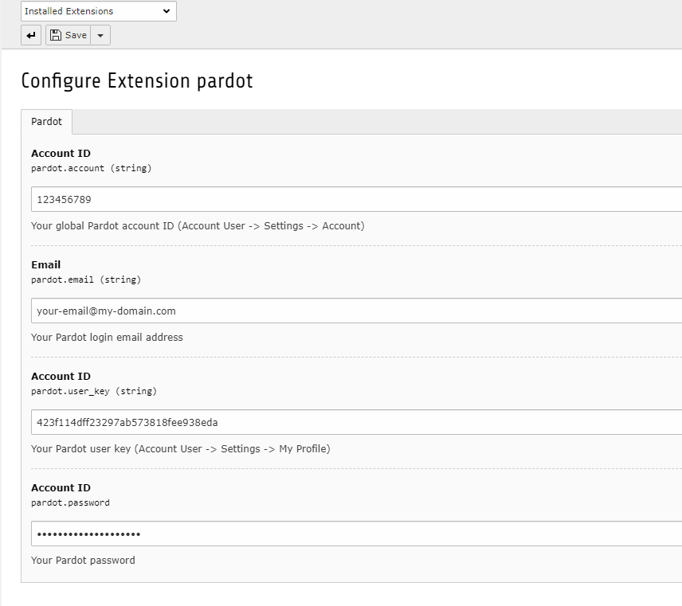

.. include:: ../Includes.txt

.. _what-it-does:

What does it do?
================

Pardot API Service based on https://github.com/Cyber-Duck/Pardot-API

A library to integrate with the Pardot API through PHP objects

This library simplifies the process of authentication and querying the Pardot API and provides access to all of the v4 API features.

.. _screenshots:

Screenshots
===========

How to add your credentials for Pardot API Service

   Pardot extension configuration

